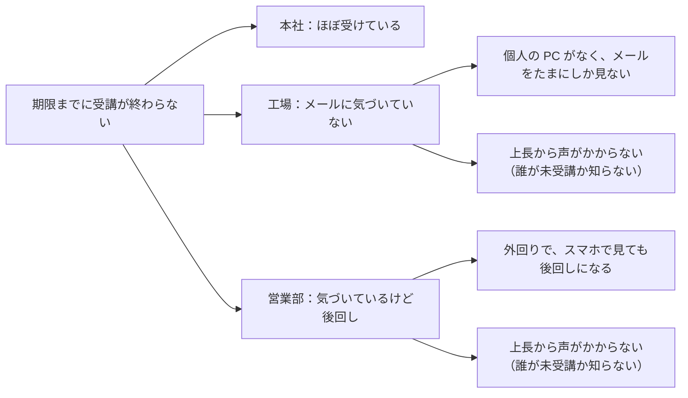

こんにちは。グロービスのGLOPLA事業開発室でエンジニアをしている堀川です。

https://speakerdeck.com/globis_gdp/globis_gdpglopla-lms-for-dev

:::message
3行でまとめると
- 打ち手（How）に飛びつく前に、一度立ち止まる
- 何に答えを出すのかを先に決めて、困りごとが「どこで」「なぜ」起きているのかを見る
- How はたくさん出してから選び、選ばなかった理由まで言えるようにする
:::

## はじめに

皆さん、手でコード書いてますか？
僕はもうほぼ全部 AI に書いてもらっています。キーボードもほとんど叩いていなくて、音声入力で AI に話しかけているだけです。

そうなってくると、エンジニアにとっては「書く」よりも「何を作るか判断する」部分がどんどん大事になってきたなと感じます。

で、自分の経験を振り返ると、打ち手に飛びついたときって大体うまくいっていないんですよね。問題がシンプルなうちはそれでもなんとかなるんですが、ある程度複雑になってくると、「とりあえずこれでいいんじゃない？」と思った打ち手は、だいたいうまくいかない。脳内のラピッドスターターが1秒で出した「ケツロン」に飛びつかない様に日々精進していきたいものですね。

今回は実際にお題を1つ使って、一度立ち止まって考える型みたいな物を学んで実践したので、架空のケースでお伝えしたいと思います。

:::details ひとりごと
「なんや、グロービスのクリティカルシンキングの宣伝やないかい。」と関西弁で思ったあなたへ
宣伝では無いんですが、エンジニアとしてもクリティカルシンキングはやっぱり凄く価値ある学びであり、実践することで仕事が上手く回る様になると感じたので、個人的には使っていきたいな〜と思っとります。
ちなみに宣伝したいなら、僕が開発しているこっちのプロダクトもちらっと見てみてください。
僕たちと一緒に人材育成の課題を解いて見ませんか？
https://gce.globis.co.jp/service/training-type/glopla-lms/
:::

## お題：「未受講者に毎日リマインドを送りたい」と言われました

架空の「ケンシュウシステム」に、あるお客さんからこんな要望が届きました。

> うちは ISO の認証を取っていて、審査で研修の受講記録を確認されるので、毎年全社員に研修を受けてもらわないといけないんです。
> でも、締め切りの1か月前になっても受講率が半分くらいしかなくて。
> 今年も締め切り前の2週間、各部署に電話して回って、なんとか間に合わせました。来年はもうやりたくないです……。
> 未受講者に毎日リマインドメールを送れるようにしてもらえませんか？

さて、どうしましょう？

:::message
このお題に出てくるお客さん、システム、カスタマーサクセスの方の話などは、すべて架空の設定です。
:::

:::details お題の詳細
- お客さん：従業員 3,000人ほどの製造業。人事部の研修担当者（1人）がケンシュウシステムを運用している
- 研修：ISO の審査に向けて、年1回全社員に受けてもらっている研修
- 今のリマインド機能：締め切りの「何日前に送るか」を最大3回まで設定できる。件名と本文は固定
- 今の組織データ：受講者ごとに部署と上長が登録されている
:::

## よくない例：打ち手に飛びついてしまう

ここからは、打ち手に飛びついていた頃の僕でお送りします。

お客さんが「毎日リマインドを送りたい」と言っている。よし、じゃあ送れるようにしよう！

さっそくコードを見てみます。ふむふむ、今はリマインドを「締め切りの何日前」に最大3回送るバッチ処理になっていると。

……これ、バッチを毎日動かすようにすればいいだけじゃん。簡単すぎる。今の AI を使えば1時間で実装できますよ。

「監督、自分やれます。やらせてください！」

オラオラオラオラ！（後ろで AI が実装中）

実装完了。PR も出しました。

「できました！これでお客さんの要望通り、毎日リマインドが送れます！どうですか！」

……と、ここでプロダクトオーナーからストップが入ります。

「ちょっと待とうか。お客さんが本当に困っているのって、どこなんだっけ？」
「あと、リマインドを設定している他のお客さん、今まで最大3回だったのが毎日届くようになっちゃうよね。さすがにうるさくない？」

あっ。

確かに、作るのは1時間でできます。でも、それで他のお客さんの体験を壊してしまったら意味がないし、そもそも毎日送れば本当に受講率が上がるのかも、まだ分かっていません。作るのが安くなっても、打ち手を外したときの代償は安くなっていないんですよね。

よーし、一旦立ち止まって考えましょう。

## 良い例：立ち止まって考え直す

さて、反省した僕がやり直します。

さっきの僕は、「毎日リマインドを送る」という打ち手から考え始めていました。今度は打ち手を考えるのを最後に回して、こんな順番で考えてみます。

1. お客さんは、本当は何に困っているのか
2. その困りごとは、どこで、なぜ起きているのか
3. じゃあ、どんな打ち手があって、どれを選ぶか
4. 「結論、こうするのがいいのではないかと思います。なぜなら〜」と一言で言えるか

### 答えを出すべき問いと、論点を決める

まずは軸を作ります。今回、何に結論を出さないといけないのか。それを考えるために、何を確かめればいいのか。この2つを最初に置いておくと、考えている途中で話が広がっても、本質のところに戻ってこられます。

逆に軸がないまま考え始めると、気づいたら全然違うところを掘っていたりします。僕も前に、それでロジックツリーを無限に広げたことがあります。

https://zenn.dev/globis/articles/7af075ecda73d2

今回のお題だと、結論を出さないといけないのは「この要望に、どう応えるのがいいか？」です。

さっきの僕は「どうやって毎日リマインドを送るか」を考えていました。お客さんが言った打ち手を、そのまま考える対象にしちゃっていたんですね。

結論を出すために、先にこの3つを置いておきます。

1. なぜ、毎日リマインドを送りたいのか？
2. なぜ、今は受けてもらえていないのか？
3. 他のお客さんにとっても価値があって、体験を壊さない打ち手はどれか？

:::message
本当は「事業にとってどんなインパクトがあるのか」という論点も、プロダクトマネジメントではとても大事です。ただ、今回はエンジニア向けの話なので、広がりすぎないように一旦外しています。
:::

1 について、お客さんの話を読み返してみます。ISO の審査があるので、毎年全社員に受けてもらわないといけない。でも今は、締め切り前に人事が各部署へ電話して回って、ギリギリ間に合わせている。
ということは、欲しいのは毎日のメールそのものではなく、**毎年、無理なく期限までに間に合う状態**なのでは？と思います。まだ仮説ですが、一旦これを目的として置いて進めてみます。

### どこで、なぜ起きているのかを分解する

目的は「毎年、無理なく期限までに間に合う状態」と置いてみました。では、なぜ今は受けてもらえていないのか？を考えます。

いきなり「なぜ」を考えると、「忙しいから」「研修がつまらないから」「メールが多すぎるから」……と、それっぽい理由がいくらでも出てきて収拾がつきません。なので先に、「どこで」止まっているのかを絞ります。

今回は、優秀なカスタマーサクセスの方がすでにヒアリングしてくれていた情報で結論が出せそうなので、それを元に、推測も少し混ぜつつ分解していきます。

図にある「上長から声がかからない」は、カスタマーサクセスの方の話から見えてきたことです。人事が毎年かけていた電話、実は各部署の責任者や上長に「部下のフォローをお願いします」と頼む電話だったそうです。上長から声をかけてもらうと、みんなちゃんと受けてくれる。でも、その上長は、普段は誰が未受講なのかを知りません。

見えてきたのは、システムからのメールは、工場ではそもそも届かず、営業部では後回しにされているということ。そして、効いていたのは上長からの声かけだったということです。

毎日リマインドを送っても、メールを見ない人には届かないし、後回しにする人は後回しのまま。回数を増やしても、解決はしなさそうです。

ちなみにこれ、人事の方も最初は気づいていなかったそうです。カスタマーサクセスの方が話を聞く中で、「電話が効いていたのは、上長から声をかけてもらえていたからでは？」と気づいてくれたんですね。優秀（架空の話ですけどね）。

:::details カスタマーサクセスの方がヒアリングしてくれた情報
- 工場：個人の PC がなく、メールはたまにしか見ない。連絡事項は朝礼で班長から口頭で伝わる
- 営業部：外回りが多く、メールはスマホで見ている。見ても後回しにしがち
- 上長：フォローしたい気持ちはあるが、誰が未受講か分からない。忙しくて自分で調べるまではできない
- 人事の電話：各部署の責任者や上長に、部下のフォローをお願いしている。上長から声がかかると受けてくれる
:::

### 打ち手を出して、考えてきたことから選ぶ

ここまで来て、やっと打ち手です。思いつくものを、とりあえず並べてみます。

| 打ち手 | 判断 | 理由 |
|---|---|---|
| リマインドを毎日送れるようにする（要望通り） | ✕ | メールを見ない人には届かない。設定している他のお客さんにもうるさい |
| リマインドの件名・本文・差出人名を編集できるようにする | ○ | 埋もれにくくはなる。ただ、メールを見ない工場の人には届かない |
| 部署ごとの受講状況を見られるようにする | ○ | 誰が未受講かは分かる。でも、上長にフォローをお願いする人事の手間は残る |
| 上長に、未受講の部下を自動でメールする | ◎ | 「部下の○○さん、△△さんが、期限まであと○日ですがまだ受講できていません」と届けば、上長がすぐ声をかけられる。人事の電話がいらなくなる。今のリマインドの日程に合わせて送れば、送る回数も増えない |
| Slack や Teams に通知する | ✕ | 工場はそもそも使っていない。お客さんごとに使うツールも違う |
| スマホアプリでプッシュ通知する | ✕ | 営業部には効きそう。でもアプリを一から作ることになり、重すぎる |

部署ごとの受講状況が見えるようになっても、結局は人事が上長に「フォローをお願いします」と頼むことになります。それなら、上長に直接届けてしまった方が早い。

上長へのメールは、お客さんが使いたいときだけ設定をオンにする形にすれば、他のお客さんの体験も変わりません。受講率に悩んでいる他のお客さんにも使ってもらえそうです。

というわけで、今回は「上長に、未受講の部下を自動でメールする」を選ぶことにしました。

:::message
とはいえ、これは「上長はメールをちゃんと見ていて、上長から言えば部下も動いてくれる」という、分かりやすい設定にしているからこその結論です。実際には、上長もメールを全然見ていない、なんてお客さんも普通にいます。そうなると、また違う打ち手を考えることになるんですよね。まあ、架空のお話なので、今回はシンプルにしています。
:::

### 端的に言える状態にする

最後に、ここまで考えてきたことを一言で言えるか確かめます。さっきの僕は「毎日送れます！どうですか！」でしたが、今度はこうです。

> 結論、上長に未受講の部下を自動でメールするのがいいと思います。
> なぜなら、お客さんが欲しいのは毎日のメールではなく、毎年無理なく期限までに間に合う状態だからです。
> 今はメールが届いていなかったり後回しにされていたりして、効いていたのは上長からの声かけでした。
> そして、使いたいお客さんだけオンにする形なら、他のお客さんの体験も変わりません。

「部署ごとの受講状況を見られる方がいいんじゃない？」と聞かれたら、「それもいいと思います。ただ、受講状況が見えても、上長へのお願いは人事の方がすることになるので、上長に直接届く方が人事の方の負担は減りそうです」と説明できます。

最初に置いた論点に一つずつ答えていくと、それがそのまま「なぜなら」になります。最初に論点を決めておいたのは、ここで言えるようにするためでもあったんですね。

## まとめ

打ち手に飛びつきたくなったら、一度立ち止まってみましょう。
今回やったのは、こんなことでした。

- 何に答えを出すのかを、先に決めておく
- いきなり「なぜ」を考えず、まず「どこで」困っているのかを絞る
- 打ち手はたくさん出してから選び、選ばなかった理由も言えるようにする

作るのが安くなった今だからこそ、何を作るかを外さないことが大事なんだと思います。

と言いつつ、僕も油断するとすぐ飛びつくんですけどね。

## 参考

ここまでやってきたのは、クリティカル・シンキングと言われる考え方です。書くときに、以下を参考にしました。

- [分析的な問題解決のプロセス | GLOBIS学び放題×知見録](https://globis.jp/article/424/)（元はバーバラ・ミント『考える技術・書く技術』で紹介されているプロセスだそうです）
- [「なぜ（Why）を5回」の前に 「どこ（Where）を30回」繰り返せ | GLOBIS学び放題×知見録](https://globis.jp/article/331/)
- [ロジックツリーの基本と使い方 | GLOBIS学び放題×知見録](https://globis.jp/article/u0m81jow_a/)
- [ピラミッド・ストラクチャー（ピラミッド構造）とは？ | GLOBIS学び放題×知見録](https://globis.jp/article/r5lw1j5dm/)
- [クリティカル・シンキングとは？ | GLOBIS学び放題×知見録](https://globis.jp/article/keqxr6i5_qkm/)
